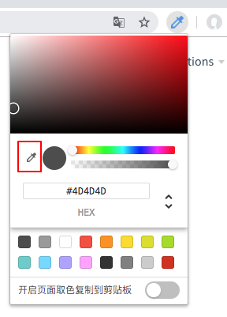
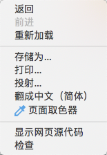

# chrome-color-picker

使用 @vue/cli3 + vue-cli-plugin-browser-extension + vue-color + ant-design-vue 驱动的 chrome 调试器风格的取色器插件。

## Project setup

```
yarn install
yarn run serve # dev 调试
yarn run build # 打包
yarn run lint  # 代码风格检查
```

Google Play 商店审核中

页面截图

1.弹出层



2.右键菜单



3.移动取色器


