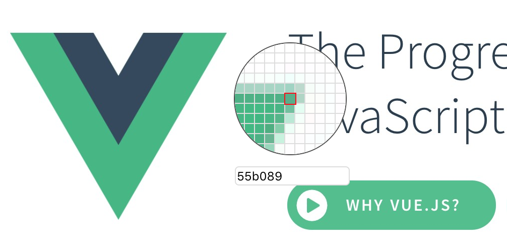

# chrome-color-picker

> 旧版本可见：https://github.com/guowenfh/chrome-color-picker/tree/backup-vue2-vue-cli

本项目使用 https://github.com/antfu/vitesse-webext chrome 插件开发模板

使用 pnpm + vue3 + vite 强力驱动。


Chrome 商店 已上架 地址 :[chrome-color-picker](https://chrome.google.com/webstore/detail/chrome-color-picker/ojaclcbknieckfcapcbifaijoocfmpaj?hl=zh-CN)

## 项目开发

```bash
// 如果没有安装 pnpm
npm install -g pnpm
```
### 文件

- `src`--主文件夹。
  - `contentScript` - 作为`content_script`被注入的脚本和组件。
  - `background` - 背景的脚本。
  - `components` - 自动导入的Vue组件，在弹出窗口和选项页中共享。
  - `styles` - 在弹出窗口和选项页中共享的样式。
  - `assets` - Vue组件中使用的资产
  - `manifest.ts` - 扩展的清单。
- `extension` - 扩展包根。
  - `assets` - 静态资产（主要用于`manifest.json`）。
  - `dist` - 内置文件，也是Vite在开发时的存根条目。
- `scripts` - 开发和捆绑的辅助脚本。

### 开发

```bash
pnpm dev
```

然后**在浏览器中用`extension/`文件夹加载扩展**。

对于 Firefox 的开发者，你可以运行以下命令来代替。

```bash

pnpm start:firefox
```

`web-ext`在`extension/`文件改变时自动重新加载扩展。

> 虽然Vite在大多数情况下自动处理HMR，但仍建议使用[Extensions Reloader](https://chrome.google.com/webstore/detail/fimgfedafeadlieiabdeeaodndnlbhid)来进行更清洁的硬重载。

### 构建

要构建该扩展，请运行

```bash
pnpm build
```

然后在`extension`下打包文件，你可以把`extension.crx`或`extension.xpi`上传到相应的扩展商店。

## 演示截图

1.弹出层


2.右键菜单


3.移动取色器




## 修改

- 2.1.0: 默认使用 eyeDropper API 取色
- 2.0.0: 升级到 vue3 + vite 

old change log：

- 1.5.0: 修复取色记录不正确的问题
- 1.4.0: 产品体验优化
- 1.1.0 ：添加 取色 键盘快捷方式 Alt+Shift+A
- 1.0.0 ：发布到 chrome 商店


